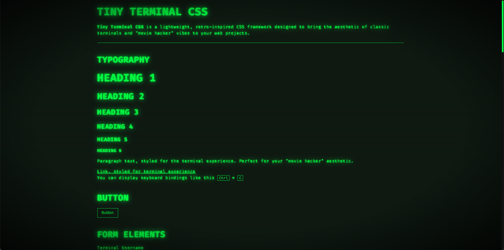

# Tiny Terminal CSS

**Tiny Terminal CSS** is a lightweight, retro-inspired CSS framework designed to bring the aesthetic of classic terminals and "movie hacker" vibes to your web projects. 

It focuses on styling semantic HTML elements directly, avoiding the use of custom classes to ensure simplicity and maintain semantic integrity.

Inspired by [Just fucking use HTML](https://justfuckingusehtml.com/) and [Tiny Brutalism CSS](https://github.com/pruger/tiny-brutalism-css).

**No frameworks. No dependencies. Just pure CSS.**

Size: ~8KB (Small enough to fit on a floppy disk!)

## Features

- 🖥️ Retro Terminal Aesthetic: Green text, glowing effects, and simple lines.
- 🖋️ Semantic HTML Styling: Works out of the box with default HTML elements.
- 🎨 Customizable: Easily tweak the colors, font or gaps.
- 🖱️ Interactive Elements: Styled buttons, forms, progress bars, and more.
- 📜 Typography: Bold headings, styled paragraphs, and flickering animations.
- 📊 Tables and Lists: Terminal-styled data organization for quick reference.
- 🔍 Details & Summary: Expandable sections styled for terminal specs.
- 🛠️ Accessibility: Focus-visible styles for keyboard navigation.

## Quick Start

### Method 1: Download
1. Download the tiny-terminal.css file from this repository.

2. Add it to your HTML file:

```html
<link rel="stylesheet" href="path/to/tiny-terminal.css">
```

### Method 2: Copy-Paste

Copy the contents of tiny-terminal.css and paste it into your project's CSS file.

## Usage

Tiny Terminal CSS works seamlessly with standard HTML elements. No additional classes are required or used.

Example:

```html
<h1>Welcome to Tiny Terminal CSS</h1>
<p>Styled with <mark><strong>TINY TERMINAL CSS</strong></mark>, inspired by retro terminals and movie hackers.</p>
<hr>
<button>Click Me</button>
<progress value="70" max="100"></progress>
<blockquote>The terminal is a gateway to the soul of the machine.</blockquote>
```

## Preview



## License

MIT License — Free for all developers. Fork, modify, and distribute freely.

## Contributing
Contributions are welcome! Submit a pull request or open an issue. All suggestions will be reviewed with care.

## Author
Created by [Mario Yordanov](https://github.com/mariovyord)